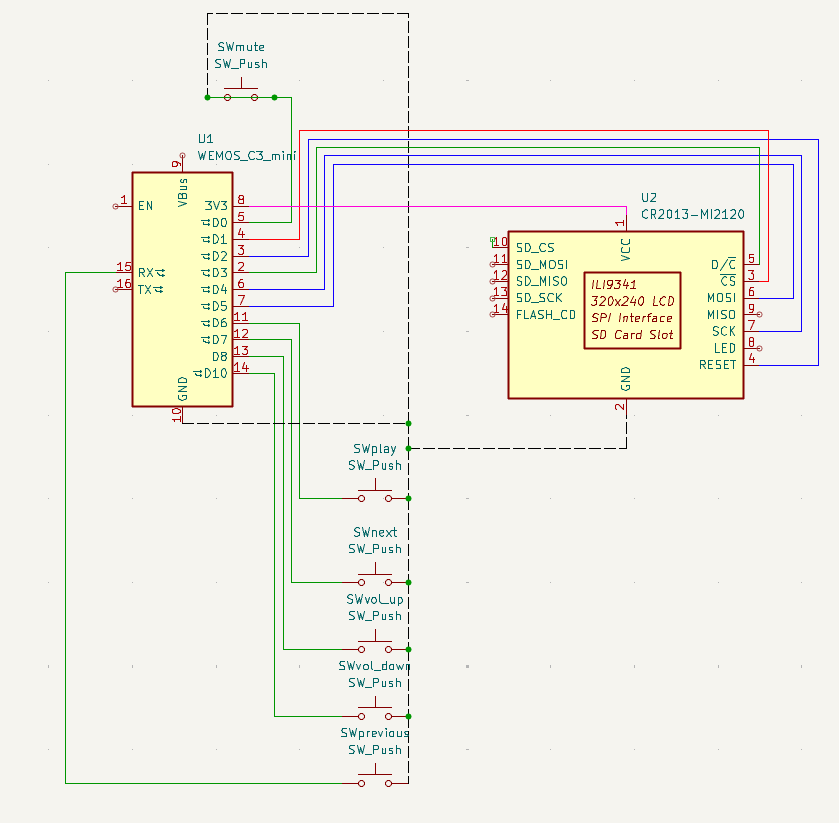
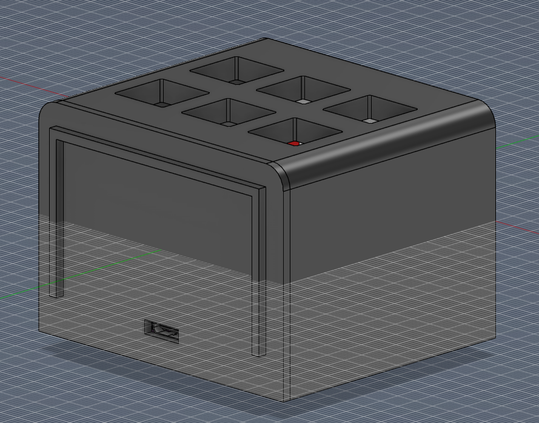
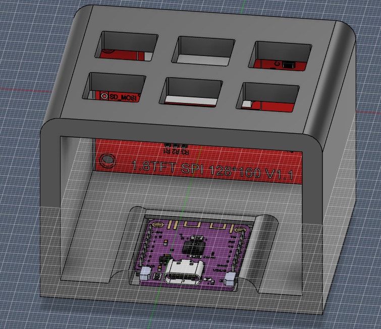
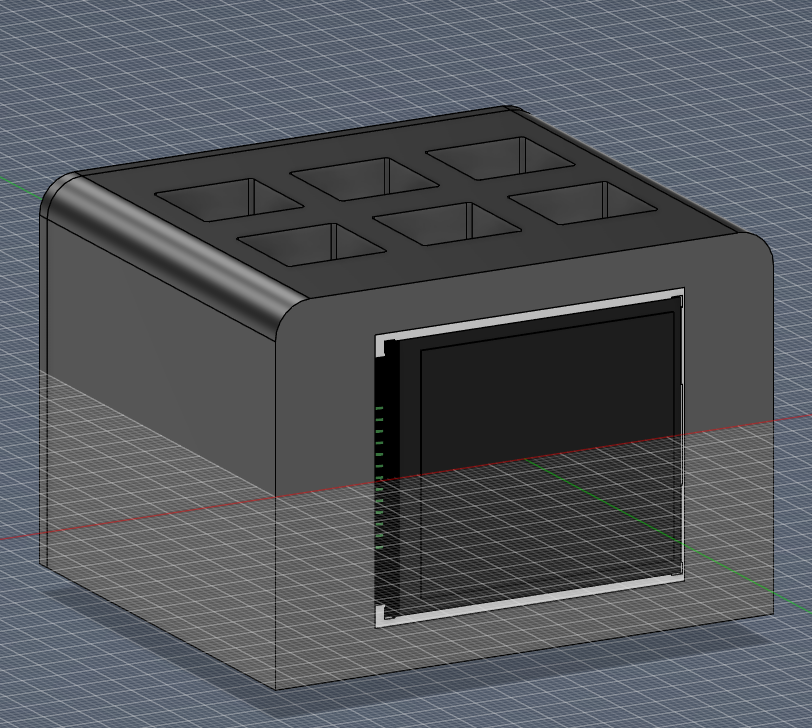

This is my WiFi-connected Spotify display that shows album art and track information on a 1.8" TFT screen, it also has 6 buttons. 3 for controling volume and 3 for the songs. 

Before uploading the file to your arduino you need to put in the details for your wifi and spotify client.
I will upload an assembly tutorial once I have all the parts.

Wiring diagram: 

Case: 

  

|BOM:|  |
|---|---|
| 1x ESP32-C3 Mini | https://nl.aliexpress.com/item/1005004740051202.html?spm=a2g0o.cart.0.0.235361d7z7llFU&mp=1&pdp_npi=6%40dis%21USD%21USD%206.26%21USD%206.26%21%21USD%205.70%21%21%21%40211b815c17735682113572176eb4e7%2112000056120453300%21ct%21NL%217103435547%21%211%210%21&gatewayAdapt=glo2nld |
| 1x 1.8inch tft display | https://nl.aliexpress.com/item/1005007038447382.html?spm=a2g0o.cart.0.0.235361d7z7llFU&mp=1&pdp_npi=6%40dis%21USD%21USD%206.18%21USD%202.97%21%21USD%202.65%21%21%21%40211b815c17735682113572176eb4e7%2112000039179865827%21ct%21NL%217103435547%21%211%210%21&gatewayAdapt=glo2nld |
| 1x 10 piece bundle of self drilling m3 screws | https://nl.aliexpress.com/item/1005008941241500.html?spm=a2g0o.productlist.main.4.538ataMJtaMJPS&algo_pvid=bb5fa61e-85e5-48de-8d5b-9d6ff0b2e3a5&algo_exp_id=bb5fa61e-85e5-48de-8d5b-9d6ff0b2e3a5-3&pdp_ext_f=%7B%22order%22%3A%2218%22%2C%22eval%22%3A%221%22%2C%22fromPage%22%3A%22search%22%7D&pdp_npi=6%40dis%21USD%211.78%211.78%21%21%2112.16%2112.16%21%40211b807017735681714654732e3f9c%2112000047291353907%21sea%21NL%21|7103435547%21X%211%210%21n_tag%3A-29911%3Bd%3Ae74134d9%3Bm03_new_user%3A-29895&curPageLogUid=rQ9zxD0Mg27H&utparam-url=scene%3Asearch%7Cquery_from%3A%7Cx_object_id%3A1005008941241500%7C_p_origin_prod%3A |
